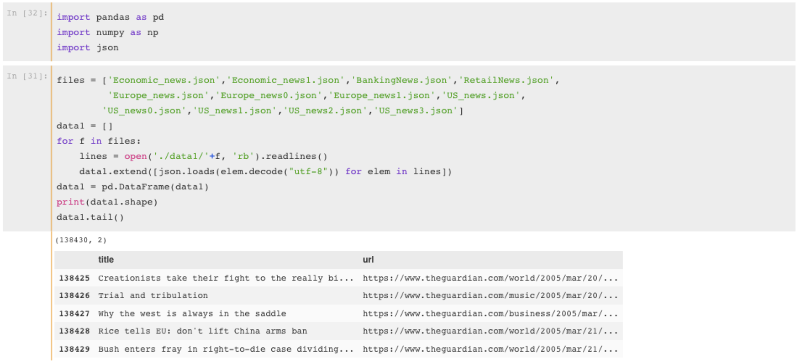

[TOC]

### 主要内容

Scrapy框架爬取英文新闻站点：https://www.theguardian.com 的部分子版块中的新闻。

- 涉及的items包括新闻标题title、新闻链接url、发布时间pubtime、新闻主题topic、评论数comment_num、分享数share_num和正文信息main_text。

### 主要成员：

@土豆 @林西 @嘿！丫头 @winchester.

### 主要贡献说明

- spiders‘ names：

  - US-news —— @土豆  `USnewsspider.py`
  - BankingNews —— @林西 `BankingSpider.py`
  - RetailNews —— @林西 `RetailSpider.py`
  - economic —— @嘿！丫头 `economics.py`
  - europe —— @嘿！丫头`europe.py`

- 整合和定义多spiders同步爬取([REF](http://www.cnblogs.com/skying555/p/5296312.html))，爬取动态js([REF](https://zhuanlan.zhihu.com/p/24838761))的评论数和分享数，DNS解析缓存([REF](http://blog.csdn.net/bone_ace/article/details/55000101)) —— @土豆

- spider中设置custom-setting来将不同的spider指定pipeline输出json文件 

  —— @林西

- more...

### 终端执行说明

（在当前目录及其子目录下执行皆可～）

1. `scrapy list`  显示所有spider的name，以确保基本的框架连接和语法没有问题。

2. 务必要确认并修改每个spider文件中目标要爬取page页面的数目。

   （注：默认为爬取全部的网页page）

3. 查看并调整 `setting.py` 文件中的设置参数`CONCURRENT_REQUESTS = 5000`

4. 在终端中执行：`scrapy crawlall` 命令，会要求所有spider同时开始解析下载信息。每个sipder会生成各自对应的json文件。若修改生成的json文件名，可查看`pipelines.py`文件。

> 可考虑在 https://www.floydhub.com/ 的免费账户上用GPU运算，常用代码：
>
> ```shell
> floyd init <project_name>
> floyd run --mode jupyter --gpu --env pytorch
> ```

### 结果与总结

1. 关于数据集：

   虽然目标爬取的新闻网站基本不需要动态加载，基本按照静态网站的处理方式即可，也基本不需要考虑反爬虫，但是由于**时间有限**，最后爬取得到的完整数据集未能直接运行scrapy得到。所以我们把爬取下来的数据集分两大类：一类是仅含title和url的数据（`./data1`），目的为了本框架实现能够一次性快速从框架中爬取所有信息；另一类是包含所有items详细信息的数据（`./data2`），是我们分步分工爬取的。

2. 关于item：

   分工爬取下来的数据，对于某些相同item来说，难免存在不足够统一的情况，如pubtime和topic。但是并不影响未来数据的使用，可以很容易数据清理好。

3. 关于代理：

   `useragent.py`文件在执行`crwalall`中会报错，但并不影响爬虫的执行。

4. `setup.py` 和commands文件夹的设置都是为了实现多spiders同步爬取，详细请见([REF](http://www.cnblogs.com/skying555/p/5296312.html))

5. `dns_cache.py` 和在每个spider中的代码 `from Eng_news.items import EngNewsItem` 以及  `_setDNSCache()` 是DNS解析缓存提高效率用的([REF](http://blog.csdn.net/bone_ace/article/details/55000101))。


### 附：

- `./data1` 的数据量级：



- `./data2` 的数据量级：


